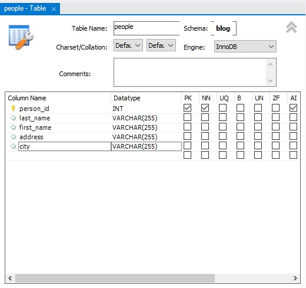
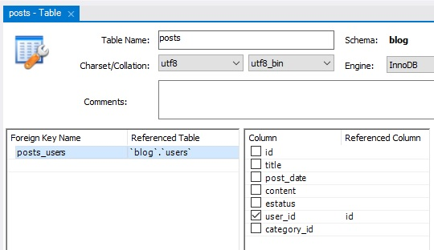
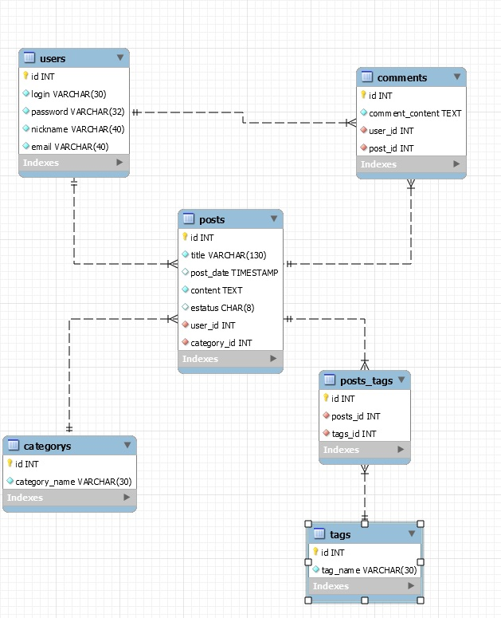

# RDBMS (Relational Database Management System)

Se trata de programas que se encargan de cumplir las reglas en bases de datos y convierten en una realidad los diagramas físicos. Para comenzar a trabajar una base de datos necesitamos un manejador de bases de datos.


**Instalar MySQL**:

* https://dev.mysql.com/downloads/

En la instalación customizada seleccionamos lo siguiente:

* MySQL Server "x" - X64 (Es el servicio)
* MySQL Workbench 8.0 (Es un cliente visual, para realizar las tareas de forma más grafica y sencilla)


### MySQL Workbench

Es un cliente grafico que representa de forma visual como funciona la base de datos, es muy útil para entender y aprender sobre bases de datos.

Dentro de la sesión agregamos un nuevo **schema** o base de datos y le asignamos un nombre. Al configurarla nos muestra como queda declarada nuestra base de datos:

```mysql
CREATE SCHEMA `blog` DEFAULT CHARACTER SET utf8 ;
```


### Servicios Administrados

Actualmente la muchas empresas ya no poseen en maquinas virtuales los RDBMS más bien contratan servicios cloud o servicios administrados. Cuando un servicio es administrado la empresa no se ocupa de administrar la base de datos, los PCS, hacer escalar, redes, etc.

Estos servicios son:

* AWS
* Google Cloud
* Azure


Configurar Google Cloud


### SQL (Lenguaje de consultas estructurado)

SQL tiene por objetivo que mediante un solo lenguaje se pueda utilizar en todos los gestores de bases de datos.

Este posee dos sub lenguajes:

* DDL
* 


### DDL(Data Definition Language)

Lenguaje que ayuda a crear la estructura de una base de datos (relaciones - entidades). Permiten manipular, crear, modificar y borrar la base entera.

Comandos principales:

* **CREATE**
  * **DATABASE - SCHEMA**
  * **TABLE**
  * **VIEW**
* **ALTER**
* **DROP**


**CREATE:** Permite crear base de datos o esquema, una tabla, una vista, indice, etc.

```mysql
/* Creamos una base de datos denominada test_db */
CREATE DATABASE test_db;

/* Comenzamos a trabajar con la base de datos  */
USE DATABASE test_db;
```

En MySQL al generar un nuevo SCHEMA con utf8 genera el siguiente contenido:

```mysql
CREATE SCHEMA `test_db` DEFAULT CHARACTER SET utf8
```

Para comenzar a trabajar con la base de datos en **MySQL Workbench** hacemos clic en la base de datos añadida y seleccionamos la opción "**Set as Default Schema**".


**TABLE:** Traducción a SQL de las entidades de la base de dato.

> Las tablas son más complejas por que pueden tener campos y constraints.

En **MySQL Workbench** ingresamos al schema generado y hacemos clic en **Tables** seleccionando en la opción "**Create Table...**".

La traducción por interfaz es la siguiente:



El código generado es el siguiente:

```mysql
CREATE TABLE `blog`.`people` (
  `person_id` INT NOT NULL AUTO_INCREMENT,
  `last_name` VARCHAR(255) NULL,
  `first_name` VARCHAR(255) NULL,
  `address` VARCHAR(255) NULL,
  `city` VARCHAR(255) NULL,
  PRIMARY KEY (`person_id`));
```


**VIEW:** Son proyecciones de los datos de la base de dato con un formato que es entendible. Las vistas toman datos de la base de datos, las presentan y las convierten en algo que se pueda consultar.

```mysql
CREATE VIEW v_brasil_customers AS SELECT customer_name, contact_name 
FROM customers
WHERE country = "Brasil";
```

> **Nota:** Por convención al generar una lista estas son nombradas comenzando por una "v".

Para generar una vista en **MySQL Workbench** hacemos clic en la opción Views y seleccionamos "**Create View...**"

La guardamos con el siguiente código:

```mysql
USE `blog`;
/* Creamos o reemplazamos una vista denominada v_blog_people */
CREATE  OR REPLACE VIEW `v_blog_people` AS
/* Tomamos toda la información de blog.people */
SELECT * FROM blog.people;
```

> Ahora podemos revisar la vista que nos da los datos que necesitamos cada vez que queramos. Otorga la información digerida.


**ALTER:** Permite alterar o modificar alguna entidad o tabla.

```mysql
/* Modificamos la tabla people */
/* 1. Añadimos una columna fecha de nacimiento de tipo fecha. */
ALTER TABLE `blog`.`people`
ADD COLUMN `date_of_birth` DATETIME NULL;

/* 2. Modificamos el tipo de dato de la columna date_of_bith a varchar. */
ALTER TABLE  `blog`.`people`
CHANGE COLUMN `date_of_birth` `date_of_birth` VARCHAR(30) NULL DEFAULT NULL ;

/* 3. Eliminamos la columna date_of_birth */
ALTER TABLE `blog`.`people` 
DROP COLUMN `date_of_birth`;
```

1. En **MySQL Workbench** podemos seleccionar la opción "**Alter Table...**" lo que nos retorna a la vista de tabla para realizar las modificaciones que queramos. En este caso agregar una nueva columna.
2. Podemos también modificar el tipo de dato desde la vista.
3. Y eliminarla.


**DROP:** Permite borrar columnas, tablas o toda la base de datos.

> Este comando puede ser sumamente peligroso pues... puedes eliminar una base de datos simplemente con el siguiente comando:
>
> ```mysql
> DROP DATABASE `blog`
> ```


### DML(Data Manipulation Language)

DDL se utiliza al comienzo del proyecto para la estructura, sin embargo DML trabaja con el contenido de la base de datos, introducir, modificar, seleccionar y eliminar datos previamente estructurados en DDL.

Comandos principales:

* **INSERT**
* **UPDATE**
* **DELETE**
* **SELECT**


**INSERT:** Agrega un nuevo registro o tupla a la tabla en la base de datos.

```mysql
INSERT INTO `people` (last_name, first_name, address, city)
VALUES ('Brignardello', 'Carlos', 'Calle uno', 'Valparaíso')
```

>  Inserta registros por cada sentencia `INSERT INTO *donde*` que se haga. Posteriormente se insertan los campos que serán insertados, se pueden dejar algunos vacíos para ello existen los valores default de las tablas. 
>
> Luego se indican los valores con `VALUES` y se agregan los valores correspondientes a los campos declarados anteriormente.

*Si ejecutamos este archivo SQL veremos que la tabla fue modificado introduciendo los nuevos datos.*


**UPDATE**: Permite actualizar o modificar los datos que ya tenemos, no serán insertados si no existen ya en la tabla.

```mysql
UPDATE people /* Actualiza la tabla people */
SET last_name = 'Brignardello', city = 'Valparaíso' /* Cambia el nombre y la ciudad */
WHERE people_id = 4; /* En la fila que contenga el id 4 */

/* Este es un UPDATE inseguro, debido a que es masivo, es decir estoy realizando un cambio sobre varios campos.*/
UPDATE people
SET first_name = 'Damaris'
WHERE city = 'Santiago'; /* En la fila que contenga la ciudad Santiago */
```


**DELETE:** Podemos borrar el contenido de una tabla. 

```mysql
DELETE FROM people
WHERE person_id = 1; // Borra todo el contenido de la fila que posee el id 1.

DELETE FROM people; // Borra todos los registros.
```


**SELECT**: Trae información de la base de datos.

```mysql
SELECT first_name, last_name
FROM people;
```

> En `SELECT` se indican que campos se quieren y `FROM` donde se indica de que tabla obtener.


### Generar tabla

```mysql
CREATE TABLE people (
	person_id int,
    last_name varchar(255),
    first_name varchar(255),
    address varchar(255),
    city varchar(255)
);
INSERT INTO people (last_name, first_name, address, city)
VALUES ('Brignardello', 'Carlos', 'Calle Uno', 'Valparaíso');

SELECT first_name, last_name
FROM people;

```

*Generamos una tabla, mostramos los valores y la borramos, esta misma sintaxis es perfectamente aplicable en PostgreSQL*


### Proyecto con RDBMS

Comenzamos a desarrollar por aquellas tablas que no poseen una llave foranea.

**Añadir tabla de categorías:**

```mysql
CREATE TABLE `blog`.`categorys` (
  `id` INT NOT NULL AUTO_INCREMENT,
  `category_name` VARCHAR(30) NOT NULL,
  PRIMARY KEY (`id`));
```

**Añadir tabla de etiquetas:**

```mysql
CREATE TABLE `blog`.`tags` (
  `id` INT NOT NULL AUTO_INCREMENT,
  `tag_name` VARCHAR(30) NOT NULL,
  PRIMARY KEY (`id`));
```

**Añadir tabla usuarios:**

```mysql
CREATE TABLE `blog`.`users` (
  `id` INT NOT NULL AUTO_INCREMENT,
  `login` VARCHAR(30) NOT NULL,
  `password` VARCHAR(32) NOT NULL,
  `nickname` VARCHAR(40) NOT NULL,
  `email` VARCHAR(40) NOT NULL,
  PRIMARY KEY (`id`),
  UNIQUE INDEX `email_UNIQUE` (`email` ASC) VISIBLE);
```

**Añadir tabla de posts**

```mysql
CREATE TABLE `blog`.`posts` (
  `id` INT NOT NULL AUTO_INCREMENT,
  `title` VARCHAR(130) NOT NULL,
  `post_date` TIMESTAMP NULL,
  `content` TEXT NOT NULL,
  `estatus` CHAR(8) NULL DEFAULT 'Activo',
  `user_id` INT NOT NULL,
  `category_id` INT NOT NULL,
  PRIMARY KEY (`id`));
```

> **Editar llave foranea de post  usuarios** 
>
> 
>
> En este caso desde la tabla posts vinculamos posts con usuarios por lo que la llave recibe el nombre de **posts_users**, esta se referencia con la **tabla usuarios** y desde el campo **user_id** de posts vinculamos el campo **id** de usuarios. Finalmente en la opción **On Update** seleccionamos "**Cascade**", lo que nos permite sincronizar los cambios entre los campos. Si ponemos "Cascade" en **On Delete** haremos que los posts del usuario se borraran si este borra su cuenta.
>
> Este cambio se refleja de la siguiente forma:
>
> ```mysql
> ALTER TABLE `blog`.`posts` 
> ADD INDEX `posts_users_idx` (`user_id` ASC) VISIBLE;
> ;
> ALTER TABLE `blog`.`posts` 
> ADD CONSTRAINT `posts_users`
>   FOREIGN KEY (`user_id`)
>   REFERENCES `blog`.`users` (`id`)
>   ON DELETE NO ACTION
>   ON UPDATE CASCADE;
> ```
>
> **Llave foranea de posts y categorias**
>
> ```mysql
> ALTER TABLE `blog`.`posts` 
> ADD INDEX `posts_categorys_idx` (`category_id` ASC) VISIBLE;
> ;
> ALTER TABLE `blog`.`posts` 
> ADD CONSTRAINT `posts_categorys`
>   FOREIGN KEY (`category_id`)
>   REFERENCES `blog`.`categorys` (`id`)
>   ON DELETE NO ACTION
>   ON UPDATE NO ACTION;
> ```

**Añadir tabla de comentarios**:

```mysql
CREATE TABLE `blog`.`comments` (
  `id` INT NOT NULL AUTO_INCREMENT,
  `comment_content` TEXT NOT NULL,
  `user_id` INT NOT NULL,
  `post_id` INT NOT NULL,
  PRIMARY KEY (`id`));
```

> **LLaves foraneas**:
>
> ```mysql
> ALTER TABLE `blog`.`comments` 
> ADD INDEX `comments_users_idx` (`user_id` ASC) VISIBLE,
> ADD INDEX `comments_posts_idx` (`post_id` ASC) VISIBLE;
> ;
> ALTER TABLE `blog`.`comments` 
> ADD CONSTRAINT `comments_users`
>   FOREIGN KEY (`user_id`)
>   REFERENCES `blog`.`users` (`id`)
>   ON DELETE NO ACTION
>   ON UPDATE NO ACTION,
> ADD CONSTRAINT `comments_posts`
>   FOREIGN KEY (`post_id`)
>   REFERENCES `blog`.`posts` (`id`)
>   ON DELETE NO ACTION
>   ON UPDATE NO ACTION;
> ```

**Añadir tabla transitiva**:

```mysql
CREATE TABLE `blog`.`posts_tags` (
  `id` INT NOT NULL AUTO_INCREMENT,
  `posts_id` INT NOT NULL,
  `tags_id` INT NOT NULL,
  PRIMARY KEY (`id`));
```

> **Llaves foraneas:**
>
> ```mysql
> ALTER TABLE `blog`.`posts_tags` 
> ADD INDEX `poststags_posts_idx` (`posts_id` ASC) VISIBLE,
> ADD INDEX `poststagas_tags_idx` (`tags_id` ASC) VISIBLE;
> ;
> ALTER TABLE `blog`.`posts_tags` 
> ADD CONSTRAINT `poststags_posts`
>   FOREIGN KEY (`posts_id`)
>   REFERENCES `blog`.`posts` (`id`);
>   ON DELETE NO ACTION
>   ON UPDATE NO ACTION,
> ADD CONSTRAINT `poststagas_tags`
>   FOREIGN KEY (`tags_id`)
>   REFERENCES `blog`.`tags` (`id`),
>   ON DELETE NO ACTION
>   ON UPDATE NO ACTION;
> ```


### Visualizar las tablas

Seleccionamos la opción Database > Reverse Engineer > *Seleccionamos nuestra conexión local y nuestra base de datos.*

Tras finalizar veremos el siguiente diagrama:

