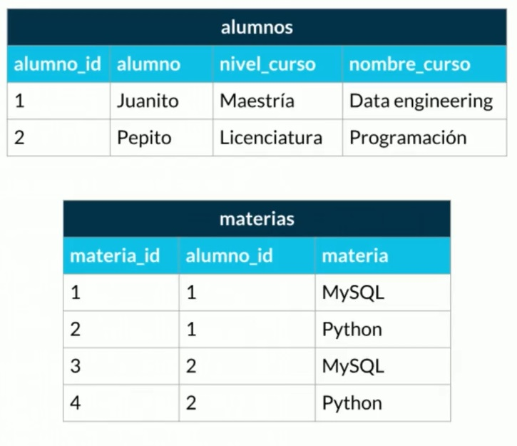

# APUNTES DE BASES DE DATOS

### Sobre la persistencia de la información

La información era pasada de boca a boca, pronto se volvió importante encontrar una forma de preservar la información más allá de la vida de un individuo, la forma más antigua de conservar información fue la escritura en piedra, luego se paso al papiro y al pergamino, estos tenían la virtud de la portabilidad. Sin embargo por sus propiedades físicas y químicas se podían descomponer con facilidad. La siguiente gran revolución fue el papel.

Posteriormente en el siglo 20 la información se comenzó a conversar en el micro film, sin embargo requería de maquinaria para su lectura y escritura. Luego los medios digitales (CDs, discos duros, discos de estado solido) permitían conservar la información en formato de bytes. 

El gran cambio que ocurrió para el almacenamiento digital fue la nube, esta es accesible desde cualquier parte del mundo, se trata de un medio centralizado que es capaz de ser utilizado por varias personas al mismo tiempo.

### Las bases de datos

Estas se dividen en dos grandes grupos relaciones y no relacionales, siendo estas últimas las más recientes.

**Bases de dato relacionales:**

* SQL Server
* **MySQL**
* MariaDB
* PostgreSQL

**Bases de dato no relacionales:**

* Cassandra
* **MongoDB**
* DynamoDB

**Servicios**

* **Auto administrados**: Es aquella base de datos que se instala en un servidor, que debe ser actualizada y mantenida.
* **Administrados**: Son ofrecidos por las nubes (Amazon, Azure). No se debe instalar ni mantener.

**TODAS LAS INDUSTRIAS UTILIZAN BASES DE DATOS.**

https://platzi.com/tutoriales/1566-bd/4120-las-12-1-leyes-de-codd/

### Entidades y atributos

**Entidad**: 

* Una entidad es **similar a un objeto** en programación, las entidades **poseen atributos**, en un diagrama las entidades **se representan como rectángulos**. **SON NOMBRADAS EN PLURAL** (por que representan a un grupo de objetos)

**Atributos**: 

* Los atributos **se representan como óvalos que se unen a la entidad**. 
* Existen **atributos multi valuados** que poseen más de un valor y **se representan con dos óvalos**.
* Existen atributos que se pueden calcular o inferir, estos **se representan con un ovalo de líneas puntuadas**.
* Existen **atributos compuestos** que son aquellos que **poseen más atributos relacionados** a ellos.
* Existen atributos que ayudan a identificar una entidad mediante un **atributo que es único para cada entidad**, este atributo es denominado **atributo llave**, **se representan por estar subrayados**.

**Tipos de atributos:**

* **Naturales:** Son aquellos que son propios de la entidad, que vienen de forma predeterminada, como el numero de serie de une equipo, su color, el año del producto, etc.
* **Artificiales:** Son aquellas propiedades que son agregadas por conveniencia y para diferenciar.

**Tipos de entidades:**

* **Fuertes:** Entidades que no dependen de ninguna otra para existir, se representan con un rectángulo.
* **Débiles:** No pueden existir sin una entidad fuerte, se representan con doble rectángulo.
  * **Débiles por identidad**: Son aquellas que no se diferencian entre sí, más que por la clave de su entidad fuerte.
  * **Débiles por existencia**: Poseen su propio identificador, dependen de todas formas de una entidad fuerte.

**Ejemplo:**

### Relaciones

Las relaciones se representan por un rombo, estas vinculan entidades según una relación que es definida mediante verbos.

**Por ejemplo:** 

* **[usuario]** *< posee >* **[publicaciones]**

### Cardinalidad

La cardinalidad es utilizada para saber cuantas entidades se relacionan con otras recurrimos a la Cardinalidad.

**Cardinalidad 1 a 1**: Existe una relación simétrica, para obtener la cardinalidad se debe sacar el número mayor de ambos lados, en este caso es de 1:1.

* Un **[usuario**] *< tiene >* un **[dato_contacto]**

**Cardinalidad 0 a 1 o 1 a 1 opcional**: Se trata de una cardinalidad opcional en la que puede que exista o no un elemento en algún lado de la relación.

* La **[sesión]** *< tiene o no>* un **[usuario]**

**Cardinalidad 1 a N**: Es una cardinalidad en la que de un lado se posee uno y del otro muchos.

* Un **[usuario**] *< tiene >* varios **[vehículos]**

**Cardinalidad 0 a N:** Es una cardinalidad opcional en la que puede o no haber una entidad de un lado y muchas del otro.

* Un **[paciente]** *< tiene o no >* varias **[habitaciones]**

**Cardinalidad N a N:** Una cardinalidad de muchos a muchos.

* Varios **[alumno]** *< tienen >* varias **[clases]**

**Diagrama de entidad relación - ER**

Los diagramas son una especie de mapa utilizado antes de conformar un proyecto. 

Un **[usuario]** *< escribe >* varios **[posts]**

Un **[usuario]** *< escribe >* varios **[comentarios]**

Un **[posts]** *< tienen >* varios **[comentarios]**

Una **[categoria]** *< tiene >* varios **[posts]**

Varios **[posts]** *< tienen >* varias **[etiquetas]**

### Tipos de datos

* **Textos:**
  * **CHAR(n):** Permite almacenar caracteres o cadenas de máximo ocho caracteres.
  * **VARCHAR(n):** Permite almacenar cadenas, se diferencia en que permite cadenas más grandes hasta 255.
  * **TEXT:** Text permite guardar cadenas muy grandes.
* **Números:**
  * **INTEGER:** Números enteros.
  * **BIGINT:** Números muy grandes.
  * **SMALLINT:** Números pequeños (99 o menos).
  * **DECIMAL(n, s):** Recibe dos parámetros(número entero, decimales).
  * **NUMERIC(n, s):** 
* **Fecha/Hora:**
  * **DATE**: Permite tener fechas asociadas, cuando se creo o se modifico un registro, etc.
  * **TIME**: Maneja la hora.
  * **DATETIME**: Maneja la fecha y la hora.
  * **TIMESTAMP**: Maneja la fecha y la hora de forma precisa.
* **Lógicos:**
  * **BOOLEAN**: Almacena verdaderos o falsos.

### Constraints (Restricciones)

Permite añadir reglas

**NOT NULL:** Al introducir datos, el valor por defecto siempre es null, se utiliza para no permitir que un valor este en blanco o en nulo.

**UNIQUE**: Se asegura que cada valor en una columna no se repita, por ejemplo se usa para los correos.

**PRIMARY KEY**: Es una combinación de las dos restricciones anteriores, los campos llaves poseen esta restricción, estos deben ser únicos y no estar vacíos.

**FOREIGN KEY**: Ligamos la llave de una tabla con otra, para identificarla de forma única.

**CHECK**: Este fue retirado de algunas bases de datos, permite definir la regla que se desee, permite añadir una condición.

**DEFAULT:** Añade un valor por defecto cuando no hay un valor especifico.

**INDEX**: Permite realizar búsquedas más rápidas en la base de datos, posee una desventaja por cada índice la base se vuelve más lenta, se utiliza cuando se busca obtener datos de forma rápida y al mismo tiempo se introducen datos con poca frecuencia.

### Normalización

Ayuda a establecer en forma normal todo, es el punto perfecto de una base de datos, es el nirvana de las bases de datos. 

**Sin normalizar**

**Normalizada con campos sin repetir (Atomizar)**: No se debe repetir ningún campo.

**Normalizada con clave única**: No se debe repetir ningún campo y además se depende de una clave única.

**Normalizada con dependencia clave:** Se cumplen las dos condiciones anteriores y los campos que NO son clave NO deben tener dependencias.

**Normalizar con campos multi valuados de clave única:** Se cumplen las condiciones anteriores y los campos multi valuados poseen una clave única.

### Diagrama Normalizado para el proyecto

En **post** añadimos la clave única de **usuarios** como una clave foranea en este caso **usuarios_id**. En comentarios ocurre lo mismo.

La regla en general es que en una relación 1:1 es indistinto a que table se le pone la referencia de la otra tabla, al tener 1:N en la tabla en donde existe N se pondrá siempre la clave foranea del campo 1.

Sucede lo mismo en **comentarios** con el atributo **posts_id**, este posee muchas relaciones con lo que obtiene la clave foranea directamente. Lo mismo sucede con **categorias** y **posts**.

**Entre posts y etiquetas sucede algo especial...**

Al tener una relación N:N no se sabe a que entidad otorgar la llave foranea, lo que se debe hacer en estos casos es agregar una tabla intermedia (pivote), esto permite ver la relación entre ambas entidades, esta posee las llaves foraneas de ambas entidades. Como alternativa se puede generar una llave denominada post_etiqueta_id para evitar generar otra tabla.
